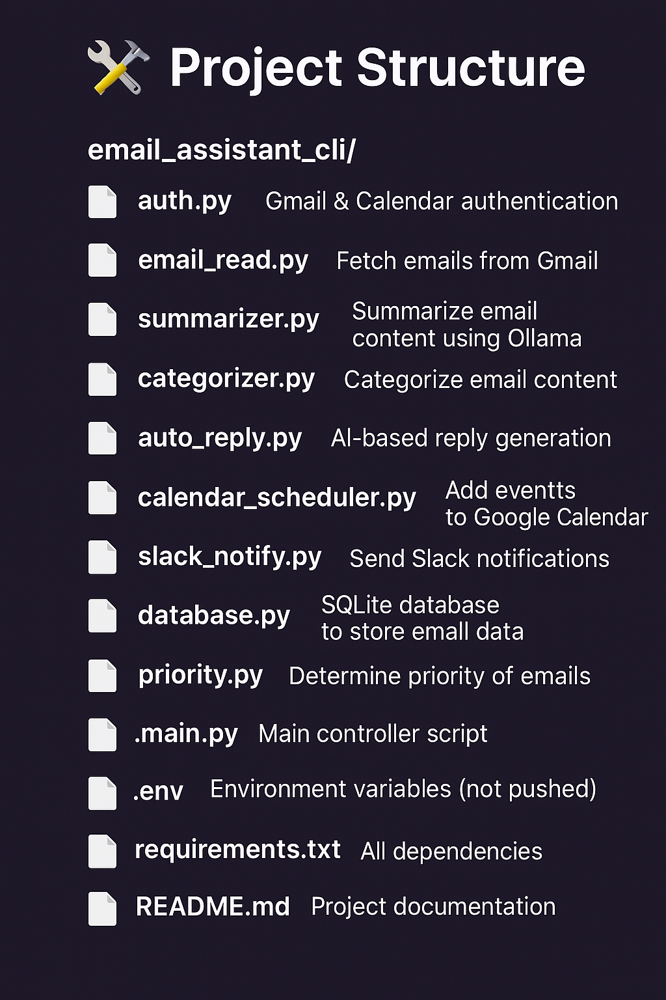
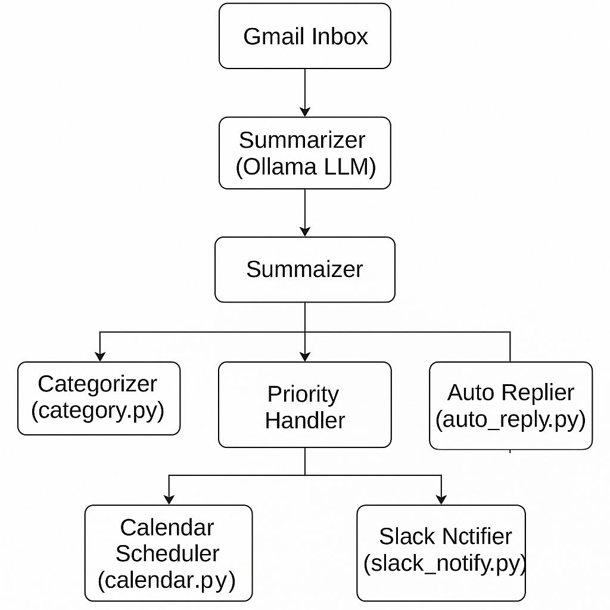

# ✉️ AI Email Assistant

This is a command-line based AI-powered Email Assistant that connects with Gmail, uses LLMs (Ollama), and integrates tools like Slack and Google Calendar to automate email workflows.

---

## 🚀 Features

- 📥 Automatically fetch emails from Gmail  
- 🧠 Summarize emails using LLM  
- 📊 Categorize emails (priority, type)  
- 🤖 Auto-reply based on context  
- 📅 Schedule events using Google Calendar  
- 📣 Notify updates via Slack  

---

## 🛠️ Project Structure
Project Structure(image1.png)

## 📦 Setup Instructions

### 1. Clone Repository

`
git clone https://github.com/vineetahujaa/wasserstoff.git
cd wasserstoff/email_assistant_cli

APIs and Tools Required
	1.	Gmail API – Used for fetching and managing emails from your Gmail inbox.
	2.	Google Calendar API – Required for scheduling meetings or adding events based on email content.
	3.	Slack API – Used to send notifications or messages to a Slack channel or user.
	4.	Ollama – Used for performing LLM-based tasks like email summarization, categorization, and auto-replies.
	5.	SERP API (Optional) – Can be used to perform Google Searches to enrich the context of an email before summarizing or replying.

           ## 📊 Architecture Diagram

The flow of the AI Email Assistant is illustrated below:

